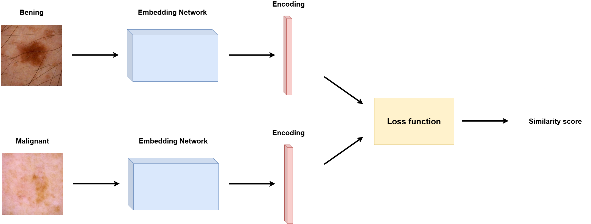

# Siamese Network | SIIM-ISIC Melanoma Classification

**Institution:** The University of Queensland\
**Created by**: Sohtaroh Arakawa (s4785692)

## Table of Contents
1. [Overview](#1-overview)
2. [Dependences](#2-dependences)
3. [Project Structure](#3-project-structure)
4. [Model and Data](#4-model-and-data)
5. [Implementation](#implementation)
4. [Results](#retults)
5. [Reference](#reference)

## 1. Overview
The objective of this project is to classify medical images of skin lesions into benign or malignant ([ISIC 2020 Kaggle Challenge](https://www.kaggle.com/c/siim-isic-melanoma-classification/overview)), using a Siamese Network-based classifier [1]. The classifier was trained on [ISIC 2020 JPG 224x224 RESIZED](https://www.kaggle.com/datasets/nischaydnk/isic-2020-jpg-224x224-resized/data) which is resized version of original dataset and aims to achieve 80% accuracy or above on evaludation dataset.

## 2. Dependences
This projected was constructed with the following dependences.
- Python 3.10.19: Core programming language for all implementations
- PyTorch 2.9.0: Deep learning framework for training and evaluation of models
- TorchVision 0.24.0: Image loading and transformation
- NumPy 2.2.6: Numerical computation and array operation
- pandas 2.3.3: CSV loading for ISIC metadata
- Pillow 12.0.0: Image loading and preprocessing
- scikit-learn 1.7.2: Evaluation metrics calculation and train-test split
- tqdm 4.67.1: Progress bar for loop
- PyYAML 6.0.3: Reading and writing YAML configure files

### 2.1 Installation
You can create an environment with required dependences by running the following.
```
conda env create -f environment.yml
```

### 2.2 Configuration
You can customise training or testing by modifying configuration file ```config.yml```. You can also modify ```preprocess_config.yml``` and conduct a new data prepration.

## 3. Project Structure
The project consists of the following files.
- ```preprocess.py```: Preprocess the ISIC dataset by splitting them into train, val, and test sets. Create meta CSV files for each set and verify if it matches with images.
- ```dataset.py```: Custome dataset that generates image pair for Siamese contrastive learning. 
- ```modules.py```: Define model architectures, including embedding network (ViT-B/16), Siamese network, classification head, and combined classifier.
- ```train.py```: Main training loop, integrating contrastive and BCE loss. Also includes visualisation and checkpoint.
- ```predict.py```: Evaluation of trained model with evaluation metrics and their plots.
- `config.yml` – Configuration file for training and evaluation. Defines dataset paths, model hyperparameters, augmentation settings, and output options.  
- `preprocess.yml` – Configuration file for data preprocessing. Specifies input metadata, image directories, split ratios, and output dataset structure.  

## 4. Model and Data
### 4.1 Siamese Network

A Siamese Network consists of two identical subnetwork which generates embeddings for a pair of inputs. By comparing these encoded features, the netwrok measures their similarity and uses this information to perform classification. [Figure 1](#figure-1-siamese-network-architecture-created-by-author) shows the architecture of Siamese Network. It shows an exmaple of *negative pair*, where the two inputs belong to different classes. The model is optimised to identify the difference in these embedding spaces to correctly classify images into classes.


#### *Figure 1: Siamese Network Architecture (created by author)*

The choice of embedding models varies depending on what the model aims to achieve. Residual Network (ResNet) is one of benchmarks for image classfication. Vision Transformer (ViT) [2] is another embedding model that has shown competitive performance, and it will be used for this project, reflecting the growing relevance of Transofomer-based backbones in computer vision field. Specifically, the project employed pretrained ```vit_b_16``` from PyTorch library [3].

Another choice in the model construction is loss function. The most commonly used loss function in Siamese Network is the contrastive loss. It is originally defined as follow:
$$
L(W,Y,X_1,X_2)=(1-Y)\frac{1}{2}(D_W)^2+Y\frac{1}{2}\{\text{max}(0, m-D_W)\}^2
$$
where $X_1$ and $X_2$ are the wto inputs, $Y=0$ if the pair is similar (same class), $Y=1$ if the pair is dissimilar (different class), and $D_W=|\!|f_W(X_1)-f_W(X_2)|\!|$ is the Euclidean distance between embeddings. $m$ is the margin which is defined as a distance threshold in embedding space that regulates the separation between dissimilar samples [4]. The project employs this exact loss function for training.

While the Siamese Network often utilised for similar scoring tasks such as face recognition, it can be adapted to classification s by creating an extra layer of classification head. This compont is optimised to effectively identify classes from encodings from ViT. Binary cross-entropy (BCE) was employed as a loss function of this classification head. The obverall loss is degined as a weighted combination:
$$
L_{total} = \alpha L_{contrastive}+\beta L_{BCE}
$$ 
where $\alpha$ and $\beta$ weight the contribution of each term.


### 4.2 ISIC 2020 Kaggle Challenge Dataset
The dataset used for this project is ISIC 2020 Kaggle Challenge Dataset. For efficient training, images were resized to 224x224, and it consists of 33126 total images. One of the challnge in this dataset is that the class distribution is significantly imbalanced. Due to the characteristic of medical data, the number of samples for malignant images are extremely limited. To address this issue, few techniques were employed which will be described later.

| Label        |  Samples  |
|:-------------|:---------:|
| 0 (Benign)   | 32542     |
| 1 (Malignant)| 584       |


## 5. Implementation

### 5.1 Training
- model comparison
- fine tuning process
### 5.2 Prediction
- evaluation metrics (process and explain what it determines)

## 6. Results
- evaluation metrics

## 7. Reference
- [1] G. Koch, R. Zemel, R. Salakhutdinov et al., “Siamese neural networks for one-shot image recognition,” inICML deep learning workshop, vol. 2. Lille, 2015, p. 0. https://www.cs.cmu.edu/~rsalakhu/papers/oneshot1.pdf
- [2] Dosovitskiy, A., Beyer, L., Kolesnikov, A., Weissenborn, D., Zhai, X., Unterthiner, T., Dehghani, M., Minderer, M., Heigold, G., Gelly, S., Uszkoreit, J., & Houlsby, N. (2020). An Image is Worth 16x16 Words: Transformers for Image Recognition at Scale. ArXiv:2010.11929 [Cs]. https://arxiv.org/abs/2010.11929
- [3] vit_b_16 — Torchvision main documentation. (2024). Pytorch.org. https://docs.pytorch.org/vision/main/models/generated/torchvision.models.vit_b_16.html
- [4] Hadsell, R., Chopra, S., & LeCun, Y. (2006, June 1). Dimensionality Reduction by Learning an Invariant Mapping. IEEE Xplore. https://doi.org/10.1109/CVPR.2006.100


